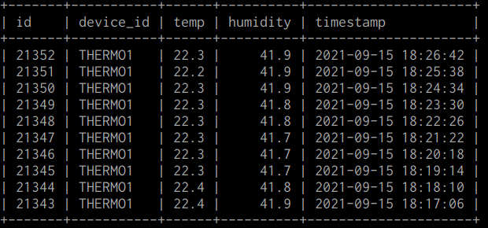

# About

A school project about recording temperatures and humidity by using Flask server, together with gunicorn, and apache2 as receiver and ESP32 board to record such values with AM2023 sensor.

# Use cases

Currently used to monitor the temperature and humidity of a single room. In real life usage the device and software have produced stable readings for the past 15 days, which is a good indicator of the stability.

The project is not portable yet, but can be made with little effort and by purchasing production grade components with functional power saving features. This is described in the thermoflask-clients -folder which is also linked below.

## About project folders

- [thermoflask-server](https://github.com/Alrahambra/flask-thermometer-client-server-demo/tree/master/thermoflask-server) houses the Flask -components of the project
- [thermoflask-clients](https://github.com/Alrahambra/flask-thermometer-client-server-demo/tree/master/thermometer-clients)  contains ESP32 codebase
- [thermoflask-present](https://github.com/Alrahambra/flask-thermometer-client-server-demo/tree/master/thermoflask-present)  contains a small demo, able to read and present values from the API endpoint

Project folders contain also initial setup instructions to succesfully deploy the project into production.

## Project in action

This is a collection of the three essential pictures that help understanding the nature of the project.

From top to bottom:

- Demo view that presents data for the past 7 days
- Picture of the board
- Sample entries logged inside the MySQL database

