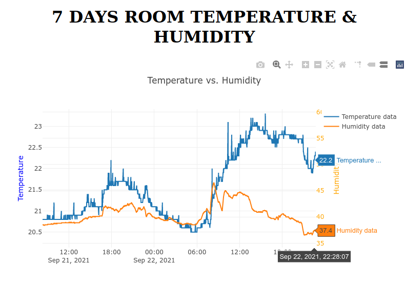

# About

This is a subproject that is able to present values from the /records -endpoint from the thermoflask-server component API.

## Setup

As a simple demo the current configuration assumes you're running the demo from the same server which is also collecting the data. In the js/plot.js file, it is possible to enter any other desireable URL if the results are hosted somewhere else.

Default assumption with the project is, that the API is available at path https://subdomain.domain.example.com/api/records

To install, host this folder in publicly available HTTP-server and alter js/plot.js if required.

## Screenshot

A functional setup looks like this:

