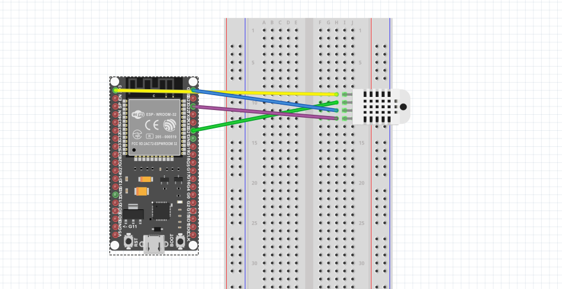
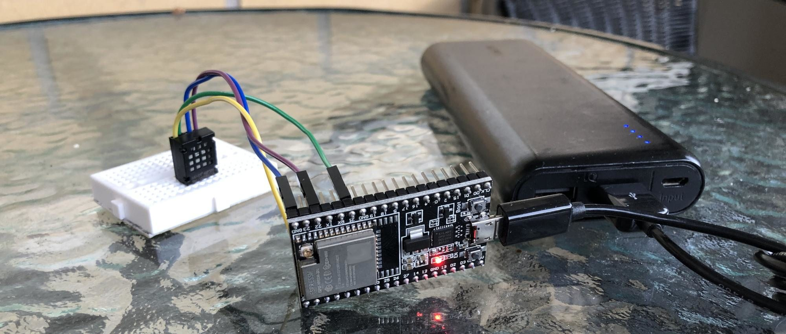

# About

This section is about the client sending the sensor data to the Flask server and also about hardware used to collect and send the data.

# Used hardware

- 1 ESP32 DEV -boards, 3.62€ /pcs + shipping. [AliExpress](https://www.aliexpress.com/item/32864722159.html?)
- 1 AM2320 temperature and humidity sensor, 1.38€/pcs + shipping. [AliExpress](https://www.aliexpress.com/item/32769460765.html?)
- Portable USB power source/ non-portable
- WIFI router


## Setup and programming

## Dependencies

- Arduino IDE or compatible IDE that can configure the project variables in the beginning of the board.ino -file
- The mentioned hardware

# Wiring and other information

### Wiring diagram

For the simplicity reasons, the colors used in the picture represent same wiring colors as used in the picture below.

As specified in the AM2023 datasheet mentioned below, reading from left to right, assuming the reading taking part of the sensor is facing forwards as in the diagram, the wiring is following for ESP32:

- Yellow line
  - ESP32 3.3V line to AM2023 power supply line
- Green line
  - GPIO21 of ESP32 to Serial Data Port of AM2023
- Blue line
  - Ground of ESP32 to Ground of AM2023
- Purple line
  - GPIO22 of ESP32 to Serial Clock line of AM2023
  




### Pictures

Assembled components on the development board functional and connected to a local WIFI network:


*From left to right: AM2320 sensor, ESP32 module and a battery pack*

## Datasheets

For interested, these datasheets might be helpful in understanding technical details of the used hardware and details in e.g. wiring and communication between boards with serial data.

Peripheral read flowchart in the AM2320 datasheet was used to handle errors in data readings providing erroneous readings.

- ESP32-WROOM
  - https://www.espressif.com/sites/default/files/documentation/esp32-wroom-32_datasheet_en.pdf
- AM2320
  - https://cdn-shop.adafruit.com/product-files/3721/AM2320.pdf


## Configuration

Configuration of a sensor unit is simple. One needs to do following configurations for the board.ino -file:

```
//WIFI SETTINGS
String wifiname = "XXXXXXXXXXXXXXXXXXXXXXXXXXXXX";
String wifipassword = "XXXXXXXXXXXXXXXXXXXXXXXXXXXXXXXXXXXX";

//UNIQUE DEVICE ID FOR LOGGING DATA
String uniquedeviceid = "THERMO1";

//YOUR GENERATED CREDENTIALS FOR THE FLASK APP
String apiusername = "XXXXXXXXXXXXXXXXXXXXXXXXXX";
String apipassword = "XXXXXXXXXXXXXXXXXXX";

//API END-POINT, SHOULD REFLECT APACHE2/OTHER HTTP SERVER CONFIG ROUTES
String apiendpoint = "https://XXXXXXXXXXXXXXXXXXXXXXXXX/api/records";
```

### Programming units

The sample code works out of the box if following dependencies and requirements are fulfilled:

1. Arduino IDE is configured to include ESP32 type boards, and ESP32 board is selected as programming target. If you've a dev board version of ESP32 it includes usually always a USB to serial module used for programming.
2. You've ArduinoJSON library aquired in Arduino IDE.
3. You've configured the code as required in the configuration section above

## About power saving features and portable use

ESP32 has multiple levels of power saving modes that can be used to save power. By using e.g. deep-sleep, it is possible to make the ESP32 unit to conserve power and run with batteries, in the best case scenario for years.

Portable powersource can be obviously used but it will not last long without power saving functionalities.

However due to the design and nature of the development boards containing power hungry components, it's not unfortunately possible to demo these features with the development board I've chosen, so this functionality is not added, but it would be easy to add e.g. with a timer, see reference to this about power saving abilities:

https://randomnerdtutorials.com/esp32-deep-sleep-arduino-ide-wake-up-sources/